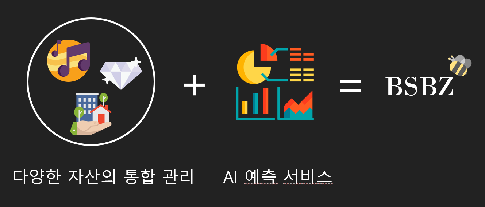
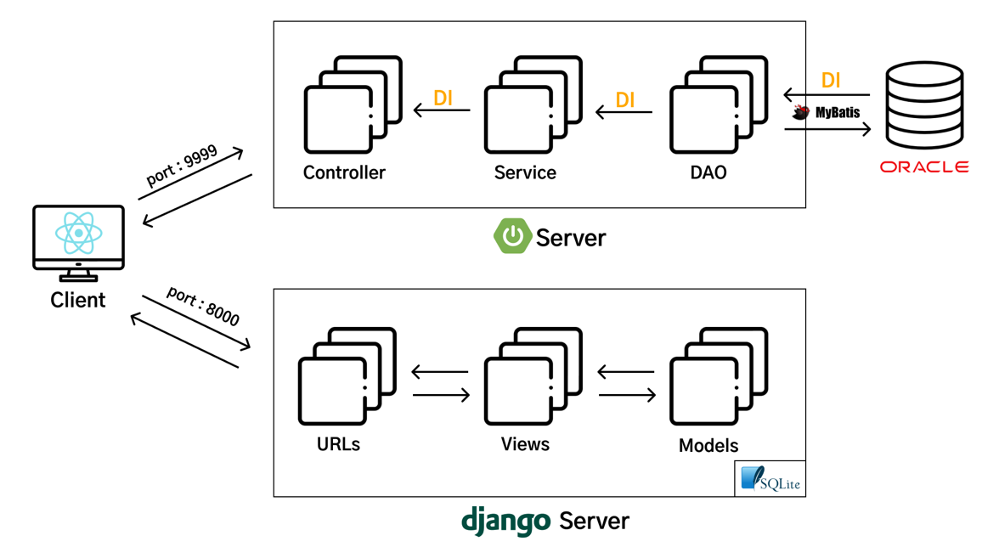
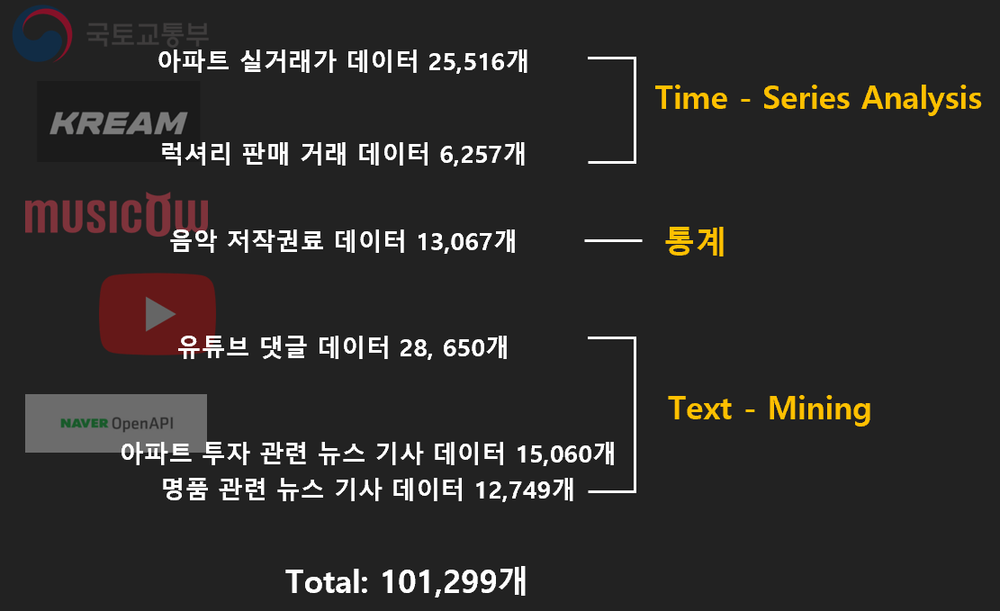
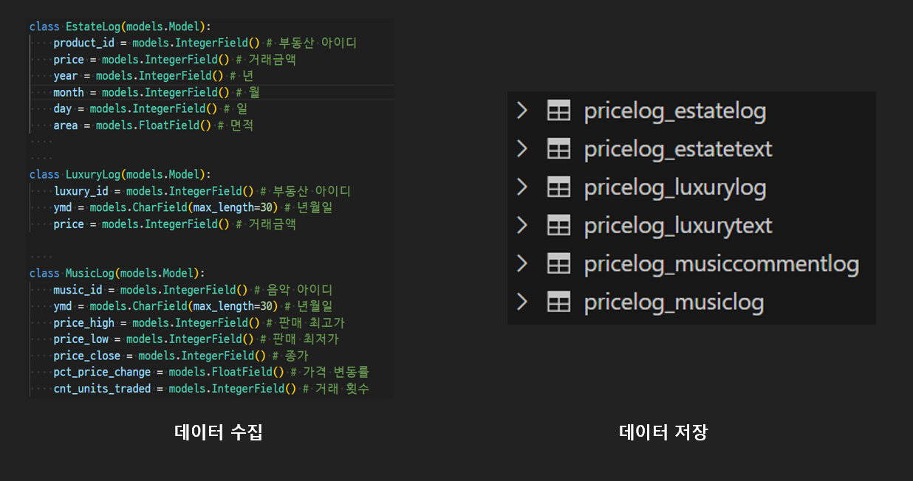
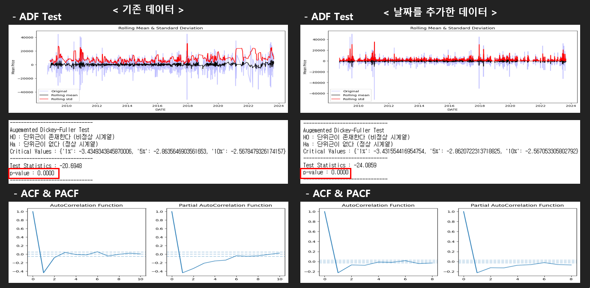
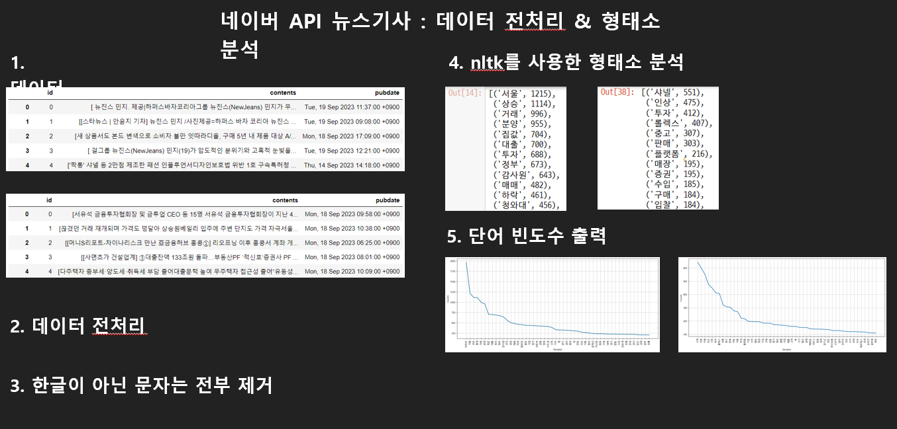

## 🐝 벌써부자 - 조각투자 멀티 플랫폼

> 2023 KB IT's Your Life 4기 최종 프로젝트
> AI 가격 예측 서비스를 제공하는 종합투자 플랫폼

 

## 🧑‍💻 팀원 소개

<table>
  <tr>
  <td align="center">
	    <a href="https://github.com/syoon6682">
	    	
	    	 
	    	
	    	<b>정승윤</b>
	    	 
	    	
	        
	    </a>
	     
	</td>
	<td align="center">
	    <a href="https://github.com/dahyeon730">
	    	
	    	 
	    	
	    	<b>정다현</b>
	    	 
	    	
	        
	    </a>
	     
	</td>
        <td align="center">
	    <a href="https://github.com/ezurno">
	    	
	    	 
	    	
	    	<b>이준모</b>
	    	 
	    	
	        
	    </a>
	</td>
        <td align="center">
	    <a href="https://github.com/sjsin0905">
	    	
	    	 
	    	
	    	<b>조용훈</b>
	    	 
	    	
	        
	    </a>
	     
	</td>
            <td align="center">
	    <a href="https://github.com/2oo1s">
	    	
	    	 
	    	
	    	<b>이주원</b>
	    	 
	    	
	        
	    </a>
	</td>
        <td align="center">
	    <a href="https://github.com/lcy923">
	    	
	    	 
	    	
	    	<b>이채영</b>
	    	 
	    	
	        
	    </a>
	     
	</td>
  </tr>
</table>

 

## ⚡프로젝트 소개

> 2023.07 - 2023.09

KB국민은행 IT 아카데미 4기

소액으로도 다양한 상품에 투자 할 수 있는 조각투자 AI 플랫폼

<ul>
  <li>투자의 세계에 첫발을 디디고 싶지만 자본이 부족하다고 느끼시나요? 걱정 마세요! 조각투자를 통해 소액으로도 큰 시장에 참여할 수 있습니다.</li>
  <li>학생이라면 더더욱 주목해야 할 기회입니다. 단 몇 천 원으로도 시작할 수 있는 조각투자는 예비 투자자에게 시장의 다양성을 경험하고 자산을 성장시킬 수 있는 기회를 제공합니다.</li>
  <li>또한 시계열 분석, 텍스트마이닝, word-cloud 를 통해 가격 예측, 대중의 심리 등 투자상품에 대한 다양한 AI 서비스를 제공 합니다.</li>
  <li>지금 바로 조각투자로 당신의 재테크 여정을 시작하세요. 우리 모두의 미래를 위한 첫걸음, 함께 걸어봅시다!</li>

[시연 영상 링크 >>](https://www.youtube.com/watch?v=WQcnG25WcMw)

</ul>

 

## ⚙️ 기술 정보

#### FRONT-END

#### BACK-END

#### AI

#### TOOL

 

## 🔍 프로젝트 상세

Youtube 링크

[시연 영상 링크 >>](https://www.youtube.com/watch?v=WQcnG25WcMw)

